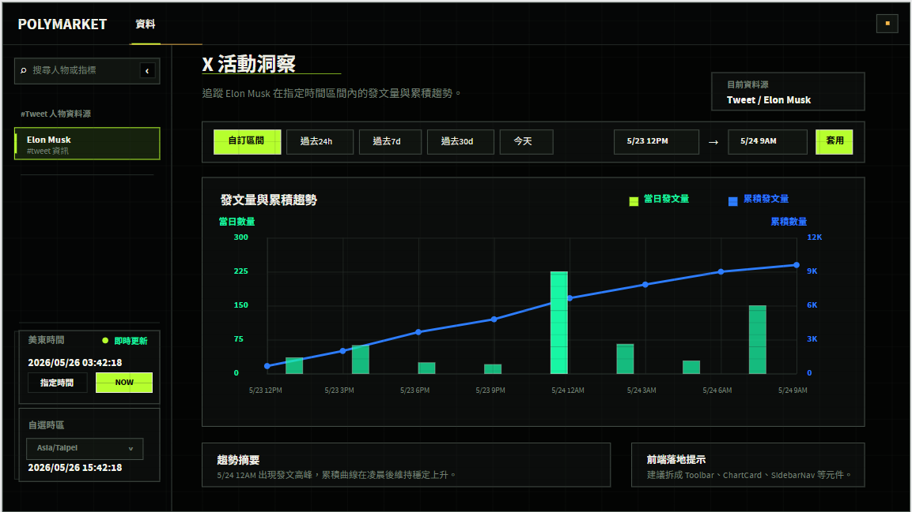
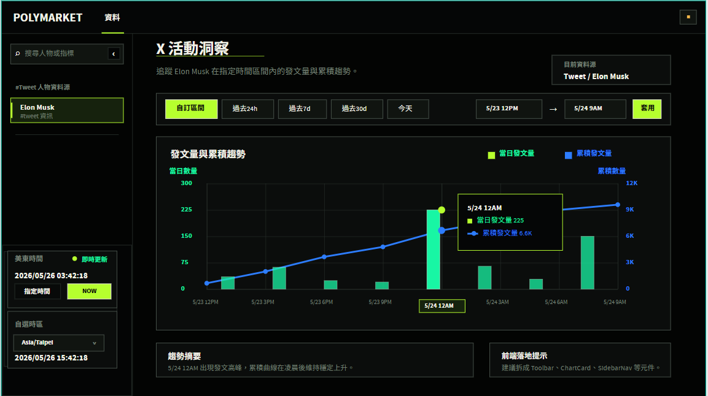
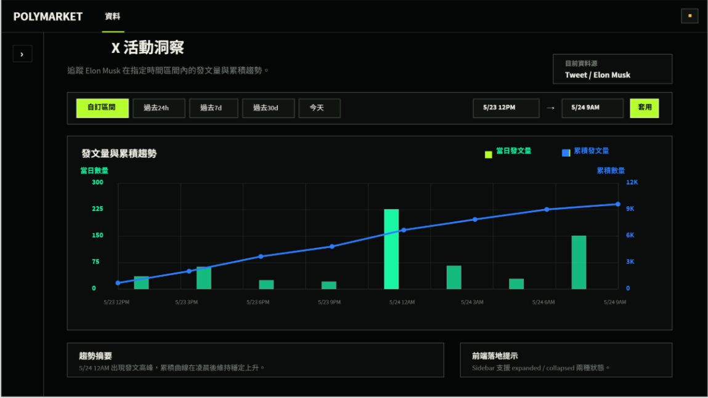

# PolyTracker Brutalist Telemetry Frontend Spec

Source: Penpot redraw using local skill `.codex/skills/brutalist-skill/SKILL.md`.

Target: implement the three Brutalist / Tactical Telemetry dashboard states shown in the exported screenshots:

- `normal.png`: expanded sidebar, no chart hover
- `hover.png`: expanded sidebar, chart hover at `5/24 12AM`
- `hide_sidebar.png`: collapsed sidebar

This is the implementation contract for a Codex CLI frontend agent. The screenshots are authoritative for visual direction, spacing, and density.

## Reference Screenshots

Use these images for visual comparison:







Image dimensions:

- `normal.png`: `1153 x 649`
- `hover.png`: `1153 x 646`
- `hide_sidebar.png`: `1149 x 647`

The frontend implementation should remain responsive, but the primary visual target is the desktop board exported near `1200 x 675`.

## Product Intent

Build a dark, tactical telemetry dashboard for tracking X/Tweet activity. The design should feel like a command-center instrument panel:

- hard black substrate
- rigid grid
- square panel boundaries
- acid-green active controls
- cyan/green bars
- cobalt cumulative line
- high-contrast technical labels

Do not turn this into a landing page. Preserve dashboard density and scan speed.

## Core Layout

Desktop shell:

- Viewport target: `1200 x 675`
- App background: black with a faint grid overlay
- Top navigation height: `56px`
- Expanded sidebar width: `216px`
- Collapsed sidebar width: `72px`
- Main content top starts below top nav
- Expanded content left edge: about `255px`
- Collapsed content left edge: about `109px`
- Main content max right edge: about `1093px`

Layout structure:

```tsx
AppShell
  TopNav
  AppBody
    Sidebar
    main.dashboard-content
      DashboardHeader
      TimeRangeToolbar
      ActivityTrendCard
      BottomPanels
```

Use CSS grid for app shell:

```css
.app-body {
  display: grid;
  grid-template-columns: var(--sidebar-width) minmax(0, 1fr);
}

.app-body[data-sidebar="expanded"] {
  --sidebar-width: 216px;
}

.app-body[data-sidebar="collapsed"] {
  --sidebar-width: 72px;
}
```

## Design Tokens

Use these tokens as the implementation baseline:

```css
:root {
  --bt-bg-app: #030403;
  --bt-bg-nav: #050606;
  --bt-bg-sidebar: #040505;
  --bt-bg-panel: #0b0d0c;
  --bt-bg-panel-alt: #080a09;
  --bt-bg-control: #101410;
  --bt-bg-active-dim: #16220d;

  --bt-border: #465049;
  --bt-border-dim: #242b27;
  --bt-grid: rgba(36, 43, 39, 0.72);
  --bt-grid-page: rgba(36, 43, 39, 0.45);

  --bt-text-primary: #f2f2e8;
  --bt-text-secondary: #b7bdaf;
  --bt-text-muted: #778178;
  --bt-text-inverse: #050606;

  --bt-acid: #b6ff2e;
  --bt-green: #18f6a4;
  --bt-green-bar: #20d89b;
  --bt-blue: #2d7dff;
  --bt-amber: #f5b849;
}
```

Typography:

- Use `"Source Sans 3", "Source Sans Pro", "Segoe UI", system-ui, sans-serif`.
- Brand: `20px`, `800`
- Page title: `26px`, `800`
- Page subtitle: `14px`
- Chart title: `16px`, `800`
- Panel title: `14px`, `800`
- Sidebar item: `13px`
- Buttons, tabs, labels: `12px`, `700-800`
- Axis labels: `10-12px`, `700`
- Avoid negative letter spacing. Use `0` or `0.4px` for technical labels only.

Shape language:

- Radius: `0px` for panels, controls, chart bars, chips, and tooltips
- Border: `1px solid var(--bt-border)` on primary panels and controls
- Secondary separators: `1px solid var(--bt-border-dim)`
- No soft shadows
- No glassmorphism
- No rounded cards
- No decorative gradient blobs

## Global Background

The page has a visible technical grid.

Use layered backgrounds:

```css
.app-shell {
  background:
    linear-gradient(var(--bt-grid-page) 1px, transparent 1px),
    linear-gradient(90deg, var(--bt-grid-page) 1px, transparent 1px),
    var(--bt-bg-app);
  background-size: 46px 46px;
}
```

Add a very subtle scanline layer only if it does not reduce text or chart readability:

```css
.app-shell::after {
  pointer-events: none;
  position: fixed;
  inset: 0;
  background: repeating-linear-gradient(
    to bottom,
    rgba(0, 0, 0, 0.10) 0,
    rgba(0, 0, 0, 0.10) 1px,
    transparent 1px,
    transparent 16px
  );
  content: "";
}
```

Keep app content above this overlay.

## Top Navigation

Normal and hover states:

- Height: `56px`
- Background: `#050606`
- Bottom border: `#242b27`
- Brand `POLYMARKET`: left `22px`, top aligned center, white, bold
- Active item `資料`: around `x=169px`, white, bold
- Active underline: acid green, `36px x 2px`, placed at nav bottom
- Right status chip: `28 x 24`, near top-right, transparent dark fill, border `#465049`
- Status dot: amber square/dot at center

Collapsed state keeps the same top nav.

## Expanded Sidebar

Expanded sidebar:

- Width: `216px`
- Background: `#040505`
- Right border: `#242b27`
- Search field: `184 x 32`, left `17px`, top `73px`
- Search field bg: `#101410`, border `#465049`
- Search icon: small white/muted glyph
- Collapse button: square dark control at search right, glyph `‹`
- Section title: `#Tweet 人物資料源`, muted
- Active person item:
  - Width: about `184px`
  - Height: `40px`
  - Fill: `#16220d`
  - Border: `#b6ff2e`
  - Left accent: acid green `3px`
  - Text: `Elon Musk` white, subtitle `#tweet 資訊` muted
- Divider below active item: `#242b27`

Fixed time panel:

- Docked to sidebar bottom
- Top divider: `#242b27`
- Card style: black/panel fill, hard border, radius `0`
- `美東時間` label muted
- Live indicator: acid green dot and `即時更新`
- Time value: white, bold
- Buttons:
  - `指定時間`: dark control, border `#465049`
  - `NOW`: acid green fill, black text
- `自選時區` card below:
  - Select control uses dark fill and hard border
  - Time value white/bold

Collapsed sidebar:

- Width: `72px`
- Hide search, nav text, and fixed time panel
- Show one expand button at `x≈20`, `y≈73`, size about `32 x 28`
- Expand button: dark control with `#465049` border, glyph `›`

## Header

Expanded:

- Main content starts at about `x=255px`
- Header top: about `y=68px`
- Title: `X 活動洞察`, `26px`, white, bold
- Add an acid-green underline under the title, about `176px x 1px`
- Subtitle: `追蹤 Elon Musk 在指定時間區間內的發文量與累積趨勢。`
- Data source chip:
  - Right aligned
  - Size: about `194 x 48`
  - Fill: `#0b0d0c`
  - Border: `#465049`
  - Label: `目前資料源`, muted
  - Value: `Tweet / Elon Musk`, white bold

Collapsed:

- Main content starts at about `x=109px`
- Header remains the same, shifted left.

## Time Range Toolbar

Expanded:

- Position: below header, around `y=153px`
- Width: about `839px`
- Height: about `54px`
- Fill: transparent or `#0b0d0c`
- Border: `#465049`
- Radius: `0`

Controls:

- Active tab `自訂區間`:
  - Acid fill `#b6ff2e`
  - Black text
  - Size: about `86 x 32`
  - Border: light/white
- Inactive tabs:
  - Dark fill `#101410`
  - Border `#465049`
  - Muted/white text
  - Same height `32px`
- Tabs: `過去24h`, `過去7d`, `過去30d`, `今天`
- Date start field: `5/23 12PM`
- Separator: `→`
- Date end field: `5/24 9AM`
- Apply button `套用`: acid fill, black text

Collapsed:

- Toolbar grows to available width.
- Date controls remain right aligned.

## Chart Card

Expanded:

- Top around `y=225px`
- Left `x≈255px`
- Width about `839px`
- Height about `316px`
- Fill: `#0b0d0c`
- Border: `#465049`
- Radius: `0`

Collapsed:

- Left `x≈109px`
- Width about `983px`
- Height about `318px`

Header:

- Title: `發文量與累積趨勢`, white, bold
- Legend placed top-right inside chart card:
  - Acid/green swatch `當日發文量`
  - Blue swatch `累積發文量`

Chart plot:

- Use ECharts.
- Use bar series for daily count.
- Use line series for cumulative count.
- Use two y axes.
- Chart grid lines: dark green-gray, hard 1px lines.
- Bars: green/cyan, square corners.
- Cumulative line: cobalt blue, `3px`, circular points.

Axis labels:

- Left axis label title: `當日數量`, green
- Left ticks: `0`, `75`, `150`, `225`, `300`
- Right axis label title: `累積數量`, blue
- Right ticks: `0`, `3K`, `6K`, `9K`, `12K`
- X labels:
  - `5/23 12PM`
  - `5/23 3PM`
  - `5/23 6PM`
  - `5/23 9PM`
  - `5/24 12AM`
  - `5/24 3AM`
  - `5/24 6AM`
  - `5/24 9AM`

Sample data:

```ts
const sampleSeries = [
  { label: "5/23 12PM", dailyCount: 35, cumulativeCount: 700 },
  { label: "5/23 3PM", dailyCount: 62, cumulativeCount: 2000 },
  { label: "5/23 6PM", dailyCount: 24, cumulativeCount: 3500 },
  { label: "5/23 9PM", dailyCount: 20, cumulativeCount: 4600 },
  { label: "5/24 12AM", dailyCount: 225, cumulativeCount: 6600 },
  { label: "5/24 3AM", dailyCount: 65, cumulativeCount: 7800 },
  { label: "5/24 6AM", dailyCount: 28, cumulativeCount: 9000 },
  { label: "5/24 9AM", dailyCount: 150, cumulativeCount: 9600 }
];
```

ECharts style baseline:

```ts
const option = {
  backgroundColor: "transparent",
  grid: { left: 82, right: 86, top: 76, bottom: 66, containLabel: false },
  tooltip: {
    trigger: "axis",
    axisPointer: {
      type: "line",
      lineStyle: { color: "#b6ff2e", width: 1 }
    },
    backgroundColor: "#050606",
    borderColor: "#b6ff2e",
    borderWidth: 1,
    textStyle: { color: "#f2f2e8" }
  },
  xAxis: {
    type: "category",
    axisLine: { lineStyle: { color: "#242b27" } },
    axisTick: { show: false },
    axisLabel: { color: "#778178", fontSize: 10, margin: 16 },
    splitLine: { show: true, lineStyle: { color: "#242b27", opacity: 0.72 } }
  },
  yAxis: [
    {
      type: "value",
      min: 0,
      max: 300,
      interval: 75,
      axisLabel: { color: "#18f6a4", fontSize: 12, fontWeight: 700 },
      splitLine: { lineStyle: { color: "#242b27", opacity: 0.72 } }
    },
    {
      type: "value",
      min: 0,
      max: 12000,
      interval: 3000,
      axisLabel: {
        color: "#2d7dff",
        fontSize: 12,
        fontWeight: 700,
        formatter: (value: number) => value === 0 ? "0" : `${value / 1000}K`
      },
      splitLine: { show: false }
    }
  ],
  series: [
    {
      name: "當日發文量",
      type: "bar",
      data: daily,
      barWidth: 22,
      itemStyle: { color: "#20d89b", borderRadius: 0 }
    },
    {
      name: "累積發文量",
      type: "line",
      yAxisIndex: 1,
      data: cumulative,
      symbol: "circle",
      symbolSize: 8,
      lineStyle: { color: "#2d7dff", width: 3 },
      itemStyle: { color: "#2d7dff" },
      emphasis: { scale: 1.45 }
    }
  ]
};
```

## Hover State

Reference: `hover.png`.

Hover bucket: `5/24 12AM`.

Add these visible affordances:

- Vertical pointer line at `5/24 12AM`: acid green, `1px`
- X-axis label highlight:
  - Acid border/fill treatment
  - Text: `5/24 12AM`
  - Black or very dark background with acid border
- Daily hover marker:
  - Acid green circle on top of the bar
- Cumulative hover marker:
  - Blue circle on line
- Tooltip card:
  - Size about `170 x 92`
  - Fill: `#050606`
  - Border: `#b6ff2e`
  - Radius `0`
  - Title: `5/24 12AM`
  - Row 1: green bullet, `當日發文量 225`
  - Row 2: blue line/dot glyph, `累積發文量 6.6K`

If ECharts cannot exactly render the x-axis label highlight, use `axisPointer.label` with matching colors, or add a positioned overlay tied to hovered index.

## Bottom Panels

Expanded:

- Two hard bordered panels under chart card.
- Left panel:
  - Width about `518px`
  - Height about `56px`
  - Title: `趨勢摘要`
  - Body: `5/24 12AM 出現發文高峰，累積曲線在凌晨後維持穩定上升。`
- Right panel:
  - Width about `296px`
  - Height about `56px`
  - Title: `前端落地提示`
  - Body: `建議拆成 Toolbar、ChartCard、SidebarNav 等元件。`

Collapsed:

- Panels grow with available width.
- Right body changes to: `Sidebar 支援 expanded / collapsed 兩種狀態。`

Panel style:

- Fill: `#0b0d0c`
- Border: `#465049`
- Radius: `0`
- Title white/bold
- Body muted

## Responsiveness

Desktop:

- Match screenshots at `1200 x 675`.
- Expanded and collapsed sidebar states must preserve fixed sidebar widths.
- Chart card and toolbar should grow when sidebar collapses.

Tablet:

- Allow toolbar controls to wrap.
- Keep chart height at least `316px`.
- Keep axis labels readable.

Mobile:

- Sidebar may stack or become a compact drawer.
- Time panel may stack below nav controls.
- Chart height at least `360px`.
- Do not shrink text with viewport units.

## Accessibility

- Sidebar toggle must expose `aria-expanded`.
- Range tabs must be buttons with `aria-pressed`, or use a proper tablist pattern.
- Date fields need accessible labels.
- Chart must keep a hidden table or equivalent screen-reader summary.
- Maintain contrast; do not reduce text opacity below the screenshot style.
- Avoid flashing or animated CRT effects.

## Implementation Notes For Codex CLI Agent

- Start from existing React components if present.
- Do not hard-code chart bars in DOM; use ECharts data.
- Preserve current data contract and mock API shape.
- Use CSS variables for all tokens above.
- Prefer component names:
  - `TopNav`
  - `Sidebar`
  - `SidebarSection`
  - `TimePanel`
  - `DashboardHeader`
  - `TimeRangeToolbar`
  - `ActivityTrendChart`
  - `BottomPanels`
- Keep edits scoped to frontend implementation files.
- After implementation, run build/typecheck.
- Run a browser visual check against:
  - expanded no-hover
  - expanded hover
  - collapsed sidebar

## Acceptance Checklist

- Expanded state matches `normal.png`: dark grid page, expanded sidebar, acid active tab, hard chart card, bottom time panel.
- Hover state matches `hover.png`: tooltip, pointer line, markers, highlighted x label.
- Collapsed state matches `hide_sidebar.png`: `72px` sidebar rail, main content expands, time panel hidden.
- Radius is visually square across panels and controls.
- Page background grid is visible but not distracting.
- Chart values, axes, legend, and tooltip remain readable.
- No marketing hero, soft cards, gradient blobs, or glassmorphism.
- Text does not overlap at desktop target size.
